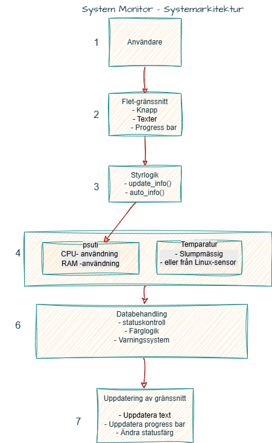

# System Monitor Project

## Struktur
systemmonitor_project/
├── src/
│   └── main.py
├── README.md
└── diagram.png
## 📊 Systemarkitektur
Diagrammet visar hur systemet hämtar, bearbetar och visar data i realtid.


## Beskrivning
Detta projekt är ett enkelt systemmonitor-program byggt i Python med Flet.

Programmet visar grundläggande systeminformation som:
- CPU-användning
- RAM-användning
- Temperatur (simulerad)
- Statusindikator

Informationen kan uppdateras automatiskt och visas i ett grafiskt gränssnitt.


Funktioner (upgrade):
Realtids CPU- och RAM-övervakning
Automatisk uppdatering var 2:e sekund
Temperatur simulering
Färgkodad statusindikator

---

## Hur man kör programmet

### 1. Aktivera virtuell miljö
```powershell

.\\\\.venv\\\\Scripts\\\\Activate.ps1


Beroenden

Projektet använder följande tredjepartsbibliotek:


Python


Flet


psutil


Funktioner

Visar CPU-användning

Visar RAM-användning

Visar temperatur

Visar status med färg

Uppdaterar information automatiskt


uppgradering:

Visar CPU- och RAM-användning i realtid

Har progress bars för CPU och RAM

Visar körtid och senaste uppdatering

Läser temperatur på Linux om sensorer finns tillgängliga

Visar färgkodad status och kritiska varningar


Reflektion

Jag valde att bygga ett systemmonitor-program eftersom det är ett konkret och användbart projekt.


Python gjorde utvecklingen enklare eftersom språket har tydlig syntax och många färdiga bibliotek.


Flet gjorde det möjligt att bygga ett enkelt grafiskt gränssnitt utan att använda mycket kod.


En utmaning var att strukturera projektet steg för steg och att få automatisk uppdatering att fungera korrekt.


Genom projektet har jag fått bättre förståelse för Python, GUI-programmering, Git och hur ett projekt utvecklas iterativt.


uppgradering:


Projektet kombinerar systemövervakning med grafiskt gränssnitt

Jag har lärt mig att använda Flet för GUI och psutil för systemdata

En utmaning var att hantera automatisk uppdatering utan att programmet fryser

Diagrammet visar hur data hämtas från systemet via psutil och bearbetas innan den visas i användargränssnittet.